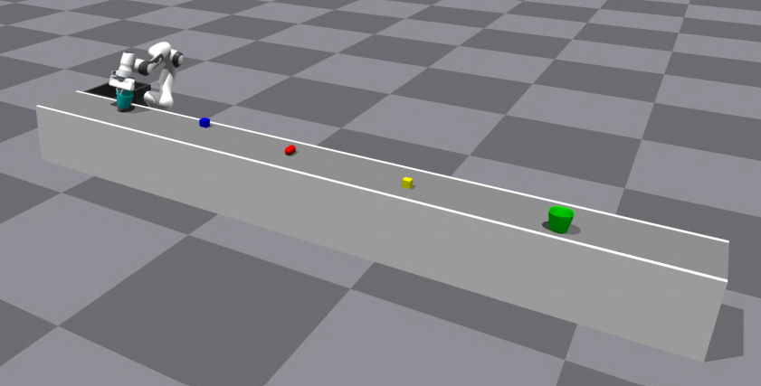

# Train Once, Deploy Anywhere: Realize Data-Efficient Dynamic Object Manipulation

[[`Paper Link`](xxx)] [[`Code Link`](xxx)] [[`Checkpoint Link`](https://huggingface.co/Zhuoling98/GEM/tree/main)]

This repo provides the official implementation of the paper "Train Once, Deploy Anywhere: Realize Data-Efficient Dynamic Object Manipulation".  Specifically, we provide the inference code, model checkpoint, and a dynamic object manipulation simulator built upon Isaac Gym to help readers better understand our work.

## Table of Contents:
1. [Installation](#installation)
2. [Data](#model)
4. [Evaluation](#evaluation)
5. [License](#license)
6. [Citing](#citing)


## Installation <a name="installation"></a>
To prepare the environment, please first create a conda environment with the following command. We do not recommend using other python versions because Isaac Gym may not support them.
``` bash
conda create -n GEM python=3.8
conda activate GEM
```
Then, please install Isaac Gym following the instructions in [Isaac Gym](https://developer.nvidia.com/isaac-gym). Our used version is 1.0.preview4. You need to install Isaac Gym using a computer with visualization and at least a GPU. Cuda should also be installed. After installing Isaac Gym, move to the installation path and run the following commands:
```
cd isaacgym/python
pip install -e .
```
Now, please go to the root directory of this project and install the following dependencies:
```
pip install torch==2.3.1 torchvision==0.18.1 -i https://pypi.tuna.tsinghua.edu.cn/simple
pip install -r requirements.txt -i https://pypi.tuna.tsinghua.edu.cn/simple

cd GEM/utils/detr && pip install -e . && cd ../../..

cd GEM/utils/sonata
pip install spconv-cu120
pip install torch-scatter -f https://data.pyg.org/whl/torch-2.3.1+cu121.html
pip install huggingface_hub==0.23.2 -i https://pypi.tuna.tsinghua.edu.cn/simple
python setup.py develop
cd ../../..

python setup.py develop
```

## Model <a name="model"></a>
Please first create a folder named `pretrained` in the folder `GEM`. We provide a trained checkpoint of GEM and other required files [here](https://huggingface.co/Zhuoling98/GEM/tree/main). Please download the file `GEM_ckpt.ckpt`, `sonata.pth`, `dataset_stats.pkl`, and save it in the folder `pretrained`. Then, the repo structure should look like this:
```
$ROOT
├── GEM
│   ├── pretrained
│   │   ├── GEM_ckpt.ckpt
│   │   ├── sonata.ckpt
│   │   ├── dataset_stats.pkl
```

## Evaluation <a name="evaluation"></a>

Please first create a folder `outputs` in the folder `GEM`. The inference results will be logged in this folder. Then, you can use the script file provided in the file `$ROOT/GEM/scripts/eval.sh` to start the provided simulation environment to evaluate the checkpoint:
``` bash
bash GEM/scripts/eval.sh
```

Then, you should see the simulator running like this:
<p align="center">
    
</p>

## License <a name="license"></a>
This project is released under [CC-BY-NC 4.0](LICENSE.md).

## Citing <a name="citing"></a>

Please use the following BibTeX entry if you find our work useful:

```BibTeX
@article{li2025gem,
  title={Train Once, Deploy Anywhere: Realize Data-Efficient Dynamic Object Manipulation},
  author={Zhuoling Li, Xiaoyang Wu, Zhenhua Xu, Hengshuang Zhao},
  journal={xxx},
  year={2025}
}
```